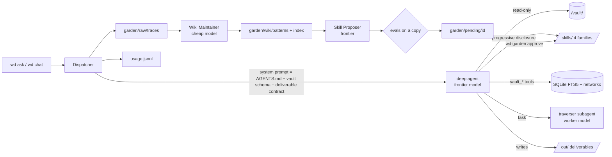

# wiki-dispatcher — architecture & MVP plan

> A CLI agent mounted to an llm-wiki vault. It **traverses** (context skills), **tends** (a garden of self-evolving skills, human-gated), and **dispatches** (a deliverable of any kind, catered to what the vault actually contains).

## 1. Thesis

Two memories, kept apart on purpose:

| | The vault (`/vault/`) | The garden (`/garden/`) |
|---|---|---|
| holds | *what is known* — the user's llm-wiki | *how to work* — patterns that evolve the skills |
| written by | the human (+ `file-back`, gated) | the evolve loop (+ `skill_manage`, ledgered) |
| read during a task | yes, via traverse skills | **no** — only the proposer reads it |
| rolled back | never (it's the source of truth) | wiki never; skills yes, via ledger |

Everything else follows from that split. The vault is untrusted content (clippings, transcripts), so the task-time agent is read-only and has no outbound tools. The garden is the agent's own experience compiled into rules, so it must never leak model priors back into the vault as facts.

## 2. Research digest (what we took, and from where)

**Karpathy's LLM Wiki** (gist, Apr 2026). Three layers — raw / wiki / schema — and three operations — ingest / query / lint. `index.md` is the catalog, `log.md` the append-only journal. The schema doc (`CLAUDE.md`) is "the most important file". Named failure modes: the flat-index ceiling (~100–500 pages), agents ignoring their own wiki, batch-ingest quality loss, *provenance drift* (inferences becoming indistinguishable from sourced facts), silent overwrite of contradictions, numeric confidence as false precision. → We read the vault's own schema into the system prompt; we surface contradictions instead of resolving them; we label "outside the vault"; we stage writes rather than commit them.

**WikiSkill** (arXiv 2608.27454, Aug 2026). Skills co-evolve with a pattern wiki: `raw/` traces → Wiki Maintainer root-causes failures into `wiki/patterns/*.md` with a one-line `PROBLEM + ROOT CAUSE + FIX` index → Skill Proposer reads index + `skill-impact.md` and emits **one atomic proposal** → accept iff validation score *strictly* improves → wiki never rolled back, skills are. Sampling is capped (≤8 traces, ≤5 failing/≤3 passing, 15k chars each). Result that matters: a 9B model with evolved skills beats a 27B without; giving the *inference* agent wiki access **hurts**. Limitations they name: no wiki pruning, no skill-retrieval eval, neutral proposals discarded. → Our `garden/` is a direct port with a human gate; `AGENTS.md` forbids reading patterns mid-task; neutral proposals are staged as `UNVALIDATED`, not dropped.

**Hermes Agent** (Nous, v0.21, Sep 2026). agentskills.io `SKILL.md` layout; a 60-char description index in the prompt; `skill_manage` with **read-before-write enforced**; background review fork after turns; a **curator** with a deterministic `active → stale → archived` lifecycle driven by `.usage.json` telemetry (`use_count`, `patch_count`, `reuse_after_patch`), never deleting, everything ledgered with rollback. Hard lesson (PR #102920): literal self-improvement produced a 100k-char skill with 71 PR numbers and 443 reference files — fix was "lessons, not incident logs" plus a linter, and a do-not-capture list (negative tool claims "harden into refusals the agent cites against itself for months"). → `registry.py` implements telemetry, sweep, ledger, archive; `validate()` lints for negative claims and incident-log shape; `garden-tend` carries the do-not-capture list.

**Harness choice.** Chad chose model-agnostic. deepagents (LangChain, 0.7.14) is the only model-agnostic runtime with spec-compliant skill loading over a mounted root, declarative filesystem permissions, subagents, and checkpointed threads. `create_deep_agent(skills=[...], backend=CompositeBackend(...), permissions=[...])` is the whole harness. Claude Agent SDK was the runner-up (richer hooks/sessions, but ties you to one provider and forbids third-party use of claude.ai auth).

**Traversal tooling.** Nothing off-the-shelf does *budgeted* branch extraction; graph tools (obsidiantools, obsidian-vault-graph, fsck's KG MCP) do structure but not token accounting. → `vault/graph.py` + `vault/pack.py` are ours; Obsidian Bases/Dataview semantics are re-implemented as `vault_tag` / `vault_frontmatter` because neither has a headless API.

**Eval loops.** skill-creator `evals.json`, `claude plugin eval` grader types (`regex`, `tool_used`, `llm`), promptfoo/inspect for matrices, GEPA for reflective rewriting, Karpathy's *autoresearch* discipline (one editable artifact, one scalar, keep-if-better, log everything). → `garden/evals.py` uses the same grader vocabulary; `evolve.py` is autoresearch with the human as the `git reset`.

Sources are listed in `docs/research-notes.md`.

## 3. Architecture



**Mounts** (virtual paths via `CompositeBackend`): `/vault/` read-only (`interrupt` if `write_vault=true`), `/skills/` read-only to the model (CRUD only through the ledgered `skill_manage` tool), `/garden/` read-only to the model, `/out/` writable.

**Layers in the package**

- `vault/` — `parse` (frontmatter, `[[links]]` incl. alias/heading/embed, `#tags`, frontmatter links) → `index` (SQLite + FTS5, incremental by mtime, link resolution by stem/alias/shortest-path) → `graph` (weighted DiGraph; `branch()` best-first under a token budget; `hubs()` by degree × PageRank × cues; `paths()`; `to_mermaid()`) → `pack` (catalog + greedy-by-priority bodies, cited) → `tools` (12 read-only LangChain tools).
- `garden/` — `registry` (discovery, validation, telemetry, lifecycle, CRUD), `ledger` (append-only + content-addressed blobs), `evals` (assertion grading, free-first), `evolve` (Algorithm 1 with injectable maintainer/proposer), `tools` (agent-facing, read-before-write enforced).
- `deliver/` — `router` (kind inference + per-kind contract text) and `writers` (Obsidian frontmatter shell; `.canvas` and CSV/JSON raw).
- `agent.py` — the factory; `trace.py` — record everything; `usage.py` — tokens and cost per run; `llm.py` — provider-agnostic helper for non-agent calls.

## 4. Skill families (18 seeds)

| family | skills | job |
|---|---|---|
| `traverse` | vault-map · branch-extract · backlink-trace · hub-find · tag-lens · timeline-slice · path-bridge · context-pack | choose and execute a traversal shape; hand off a cited, budgeted pack |
| `garden` | garden-tend · garden-evolve · garden-eval | show/add/update/archive skills; drive and explain the loop; write evals |
| `deliver` | deliver-brief · deliver-markdown · deliver-marp · deliver-canvas · file-back | contract first; then the kind-specific shape; staged write-back |
| `wiki` | wiki-lint · wiki-query | Karpathy's lint and query operations |

Each skill has `SKILL.md` (rules + steps, <150 lines), `PURPOSE.md` (why; motivating patterns — WikiSkill's provenance for skills), optional `evals/evals.json`. Pinned: `garden-tend`, `branch-extract`, `deliver-brief`. Skills teach *when/how*; tools do the deterministic work — so a skill patch never changes what the code does, only how the model composes it. That is what makes automatic evolution safe to gate.

## 5. The garden (skill evolution, human-gated)

```
wd garden evolve [--skill X]
  1 maintain   sample traces (≤5 fail, ≤3 pass, 15k cap) → patterns/*.md + index row + logs.md     [cheap model]
  2 propose    index + skill-impact + catalog (+ target skill) → ONE atomic proposal (patch|create)    [frontier]
  3 validate   apply on a COPY of skills/ → run the skill's evals baseline vs candidate                [worker]
  4 stage      garden/pending/<id>/{proposal.md, diff.patch, SKILL.md.new, meta.json}; ledger row
wd garden approve <id> | reject <id> --reason   → registry.update (ledgered) ; skill-impact.md
wd garden sweep                                  → active→stale→archived by inactivity (never deletes; skips pinned; use=0 is not staleness)
wd garden rate <trace> <1-5>                     → traces become fail/pass for sampling
```

Invariants (also in `AGENTS.md`): one proposal per iteration · wiki never rolls back · inference agent never reads patterns · rejected proposals stay visible to the proposer · lessons not incident logs · archive not delete · read before patch · every mutation has an actor and a reason.

Telemetry per skill (`garden/.usage.json`): `use_count`, `view_count`, `patch_count`, `patch_generation`, `reuse_after_patch`, `created_by ∈ {human, agent, evolve}`, `state`, `pinned`.

## 6. Deliverables

Kind is inferred from the ask (`router.infer_kind`) or forced with `--as`. The kind's contract is appended to the system prompt; `deliver-brief` makes the agent restate it as *Kind · Audience · Done-when* before traversing. Kinds: `note` (default) · `brief` · `report` · `outline` · `table` · `dataset` (CSV/JSON) · `marp` · `canvas` (JSON Canvas with live `file` nodes) · `mermaid` · `wikipage` (staged via `file-back`). Every markdown deliverable gets frontmatter — `type: deliverable`, `kind`, `trace`, `tags: [dispatch/<kind>]`, `sources: [[…]]` harvested from the body — so it joins the graph and links back to the run that made it.

## 7. Models, cost, and not melting the computer

Three tiers in config: `frontier` (dispatch, proposer), `worker` (traverser subagent, eval runs), `cheap` (maintainer, judges) — any `provider:model` string; `cheap` can be a local Ollama model. Every run logs provider-reported tokens per model and a list-price cost estimate to `usage.jsonl` (`wd usage --days 7`). Evals are free-first (`contains`, `regex`, `tool_used`, `skill_used`, `max_tool_calls`) with `llm_rubric` opt-in. The traverser subagent runs on the worker tier so parallel branch extraction doesn't burn frontier tokens.

## 8. MVP plan

| phase | scope | acceptance | status |
|---|---|---|---|
| **0 · deterministic core** | fixture vault, index, graph, branch, pack, hubs, paths, `wd vault *`, registry, ledger, lint, traces, usage | 17 tests green; `wd vault branch` on a real vault returns a cited pack under budget | ✅ in scaffold |
| **1 · dispatch loop** | deep agent over mounts, 12 vault tools, 18 skills, `wd ask` → deliverable file, `wd chat` REPL, trace + usage per run | `wd ask "brief on X"` on fish_crypt produces an Obsidian-native brief citing ≥3 notes; skills detected in trace | wired; needs an API key run |
| **2 · garden management** | `garden-tend` via agent and CLI; `skill_manage` read-before-write; archive/restore/pin; sweep | agent lists/adds/patches a skill through chat; ledger shows actor + reason; sweep transitions a stale test skill | ✅ code + tests; agent path needs key |
| **3 · evolution loop** | rate → maintain → propose → validate on copy → pending → approve/reject; `garden-eval` writes evals | one full iteration on the fixture vault stages a diff with baseline/candidate; approving bumps version and ledgers | ✅ loop tested with fake LLMs; live run needs key |
| **4 · deliverable breadth** | marp, canvas, dataset, mermaid, wikipage/file-back staging; `traverser` subagent for multi-seed asks | each kind produces a valid file (`.canvas` parses, Marp renders); two-seed ask uses `task` | writers + skills seeded; canvas/marp untested with a live model |
| **5 · hardening** | SQLite checkpointer for resumable threads (`langgraph-checkpoint-sqlite`), `wd garden rollback <ledger-id>`, `.agents/skills` symlink for Codex/Hermes interop, qmd/embedding hybrid search past the index ceiling | resume a thread after restart; rollback restores blob; hybrid search on a 2k-note vault | not started |

**First three live sessions to run** (each is a test of a different family): (1) `wd ask "What does this vault say about skill evolution?"` on the fixture → checks branch-extract + deliver-markdown + citations; (2) `wd chat` → "show me your skills, then add a skill called `daily-digest` that summarises the last 7 daily notes" → checks garden-tend's create path and the ledger; (3) rate two traces, `wd garden evolve --skill branch-extract` → inspect `garden/pending/*/proposal.md`.

## 9. Risks and open questions

- **Skill trigger accuracy.** deepagents injects name+description for all 18 skills; WikiSkill explicitly did not evaluate retrieval as the count grows. Mitigation: families as separate `skills=` sources, `wd garden sweep`, and an eventual `/skill-doctor`-style "never invoked" report from `.usage.json`.
- **Evals are thin.** Only 3 skills ship with evals, so most first proposals will be `UNVALIDATED`. `garden-eval` exists to fix that; the plan is to write evals *from* rated traces (a passing trace is a regression case).
- **Token estimate without tiktoken.** Falls back to words×1.3 if the encoding cannot be downloaded; budgets are then approximate. Vendor the `cl100k_base` file in phase 5.
- **Kind inference is regex.** Good enough for the MVP; the `deliver-brief` skill can override. A cheap-model classifier is a one-line swap in `router.py`.
- **Vault write path.** `write_vault=true` uses deepagents' `interrupt` permission; the REPL does not yet render the interrupt prompt. Until phase 5, `file-back` stages into `/out/_wiki-staging/` and the human moves files.
- **Contradiction handling.** Surfacing is a rule in three skills, not a check in code. `wiki-lint` check 7 is the model-driven part; consider a deterministic "opposing-claims" heuristic later.

## 10. Designed-for-later (leave room)

- **Autoresearch mode.** `wd garden evolve --auto --budget 2.00` — unattended keep-if-better loop with `results.tsv`, for skills that have ≥5 evals. Same code path; only the gate changes.
- **Frontier-model handoff.** Tiers are strings; when a stronger model appears, change one line. The proposer benefits first.
- **Multi-vault.** `~/.wiki-dispatcher/vaults/<slug>/` already keys the index per vault; add `wd mount --name` and cross-vault `path-bridge`.
- **Obsidian side.** A tiny plugin (Pocket-Frog lineage) that runs `wd ask` on the current note and drops the deliverable beside it; the `.canvas` writer already speaks the native format.
- **MCP surface.** Expose `vault_*` tools as an MCP server so Claude Code / Hermes / Codex can traverse the same vault with the same budgets.
- **GEPA for descriptions.** Optimise the 18 descriptions for trigger accuracy against held-out prompts — the cheapest measurable win.

## 11. This session's usage

Research: three parallel agents, ≈430k tokens total (Hermes source clone + docs, WikiSkill + llm-wiki + traversal libs, harness/SDK/eval landscape). Build + verify: one agent, this session. Deterministic layer runs with zero model calls; the scaffold's first live run will be its own first trace.

Sources: `docs/research-notes.md`
